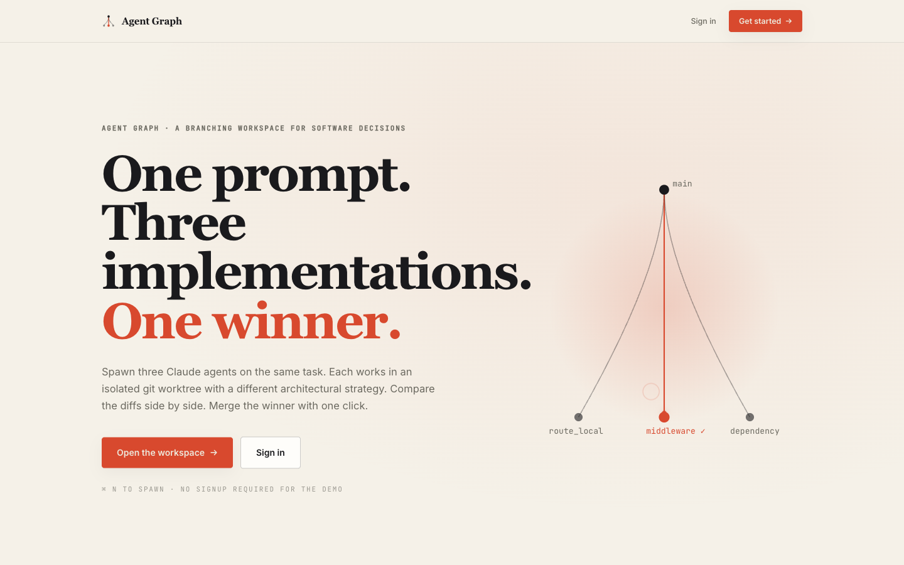
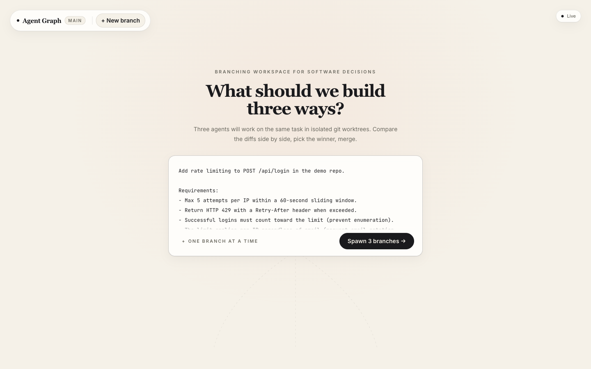
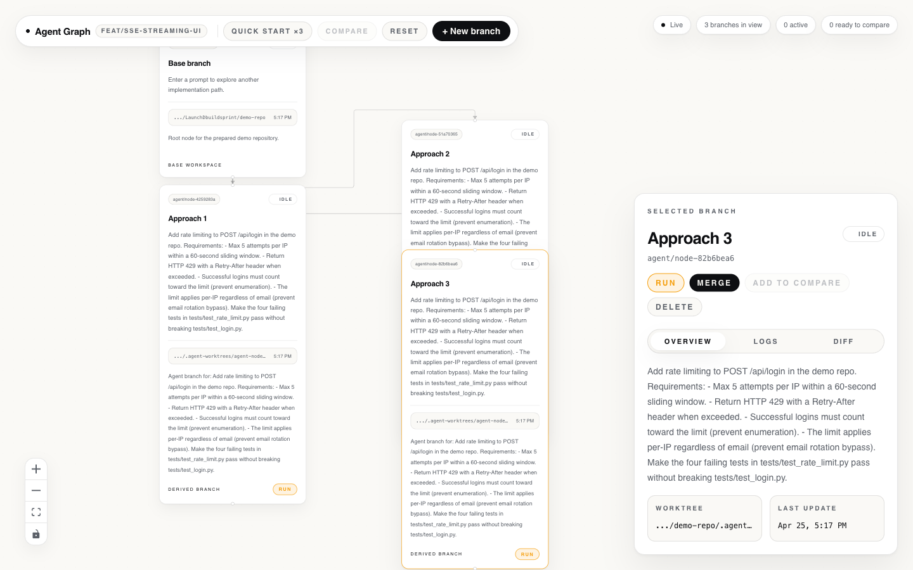
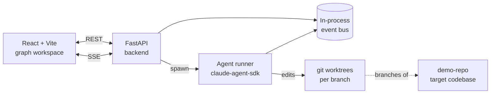

# Agent Graph

**A branching workspace for software decisions.** Spawn three AI agents on the same task, each in an isolated git worktree with a different architectural strategy. Compare the resulting diffs side by side. Merge the winner.



---

## Why

Real engineering work isn't linear. You don't write the rate limiter once — you weigh "middleware vs route-local vs dependency injection," argue about it, sometimes prototype two, then commit. Chat-based AI coding tools collapse that into a single conversation thread: one prompt, one answer, no branching, no comparison.

Agent Graph treats implementation paths as first-class. Each node is a real git worktree on a real branch with a real Claude agent running inside it. Three siblings means three real diffs you can read against each other before anything touches `main`.

## The demo loop

1. **Write one prompt.** "Add rate limiting to `POST /api/login`. 5 attempts per IP per minute. Return 429 with `Retry-After`."

   

2. **Spawn 3 branches.** One agent attempts a `middleware` solution, one tries `route_local`, one goes `dependency`-injected. Each runs in its own worktree, streamed live over SSE.

3. **Compare side by side.** Read the three diffs in a real diff viewer, see tests pass/fail per branch, pick the winner.

   

4. **Merge.** One click promotes the chosen branch into `main`. The other two stay around for reference until you reset.

## Architecture



- **Frontend** (`frontend/`): React 18, Vite, Tailwind, `@xyflow/react` for the graph, `react-diff-viewer` for the compare view. Subscribes to a single SSE stream and a per-node SSE stream for live agent output.
- **Backend** (`backend/`): FastAPI. Owns the graph state, the SSE event bus, worktree CRUD, and the task manager that supervises agent runs.
- **Agent runner** (`backend/app/agent_runner/`): Wraps the Claude Agent SDK. Each strategy biases the system prompt so the three siblings actually diverge instead of producing three copies of the same diff.
- **Demo repo** (`demo-repo/`): A small FastAPI + SQLite "support inbox" app the agents operate on. Real code, real tests, real `git diff`.

See [`docs/architecture.md`](docs/architecture.md) for component-by-component detail and [`docs/api.md`](docs/api.md) for the REST + SSE contract.

## Tech stack

| Layer | Choice | Why |
|---|---|---|
| Frontend framework | React 18 + Vite | Fast HMR, mature ecosystem |
| Graph rendering | `@xyflow/react` + `dagre` | Auto-layout that handles dynamic node insertion cleanly |
| Diff viewer | `react-diff-viewer-continued` | Drop-in side-by-side rendering for `git diff` text |
| State | Zustand | Minimal store, no boilerplate, plays well with SSE |
| Styling | Tailwind + design tokens | See [`frontend/docs/tokens.md`](frontend/docs/tokens.md) |
| Backend | FastAPI + Pydantic | Async-native, automatic OpenAPI, typed responses |
| Streaming | Server-Sent Events | One-way push fits the agent-progress shape better than WebSockets |
| Agent SDK | `claude-agent-sdk` | First-party tool-use loop without re-implementing it |
| Isolation | `git worktree` | Real branches, real diffs, no in-memory fakes |
| Package mgmt | `uv` (Python), `npm` (JS) | `uv` for fast resolves; `npm` for Vite compatibility |

## Run it locally

**Prerequisites**: Python ≥ 3.10, [`uv`](https://github.com/astral-sh/uv), Node ≥ 18, `git`. An Anthropic API key if you want real agent runs (otherwise the backend runs in mock mode and the demo still works end-to-end).

**1. Backend** (port 8000)

```bash
cd backend
uv sync
uv run uvicorn app.main:app --reload --port 8000
```

Optional environment:

```bash
export ANTHROPIC_API_KEY=sk-ant-...
export AGENT_GRAPH_ENABLE_REAL_RUNS=true   # off by default; mock agents otherwise
```

**2. Frontend** (port 5173)

```bash
cd frontend
npm install
npm run dev
```

Then open <http://127.0.0.1:5173>. The landing page lives at `/` and the workspace at `/app`.

**3. Demo repo** (optional, port 8010 — only needed if you want to *run* the support-inbox app the agents are editing)

```bash
cd demo-repo
uv sync
uv run uvicorn app.main:app --reload --port 8010
```

The Agent Graph backend operates on `demo-repo/` via `git worktree` regardless of whether the demo-repo app is itself running.

## Project status

Hackathon build (Apr 2026). The core loop — spawn three, stream live, diff, merge — works end-to-end. Known constraints by design: single prepared repo, no auth, no PR creation, no multi-provider routing. See [`docs/architecture.md`](docs/architecture.md#scope-decisions) for the full "we said no to this" list.

## License

[MIT](LICENSE) © 2026 Aayush Baniya
