# Architecture

## The shape

Agent Graph is three processes plus a git repository:

```mermaid
flowchart TB
    subgraph Browser
        UI[React workspace<br/>Vite dev server :5173]
    end

    subgraph Backend [Python — FastAPI :8000]
        API[REST router<br/>app/api.py]
        BUS[(EventBus<br/>app/events.py)]
        STATE[GraphState<br/>app/state.py]
        TM[TaskManager<br/>app/task_manager.py]
        RUNNER[agent_runner<br/>claude-agent-sdk]
        WT[worktree_service<br/>git plumbing]
    end

    subgraph FS [Filesystem]
        DEMO[(demo-repo/<br/>main branch)]
        WORKTREES[(demo-repo/.agent-worktrees/<br/>branch-per-node)]
    end

    UI <-->|REST: POST /branches/triple, GET /nodes/:id/diff, POST /nodes/:id/merge| API
    UI <==SSE: /graph/sse, /nodes/:id/sse==> API

    API --> STATE
    API --> TM
    API --> WT
    API --> BUS

    TM --> RUNNER
    RUNNER --> BUS
    RUNNER -->|edits files in| WORKTREES

    WT -->|git worktree add/remove| WORKTREES
    WORKTREES -.->|branches of| DEMO
```



## Components

### Frontend (`frontend/`)

A React workspace at `/app` and an editorial landing page at `/`. Single Zustand store owns the graph; one SSE connection to `/api/v1/graph/sse` keeps it in sync, and per-node SSE streams carry agent text/tool-use events into the side rail.

The graph itself is `@xyflow/react` with `dagre` for auto-layout. The compare view is a fullscreen panel using `react-diff-viewer-continued` against the JSON returned by `GET /nodes/:id/diff`.

### Backend (`backend/app/`)

- **`api.py`** — every HTTP and SSE route. Single router under `/api/v1`. Owns no business logic that isn't trivially expressible inline; everything substantial delegates to a service or to `graph_state`.
- **`state.py`** — in-memory `GraphState` (nodes, edges). Snapshot-based reads; mutations always emit a corresponding event via the bus. Resets cleanly via `reset_to_root()`.
- **`events.py`** — `EventBus`. Async fan-out with per-subscriber predicate filtering, so the per-node SSE stream filters at the bus layer rather than scanning serialized JSON downstream. Drops messages with backpressure logging if a subscriber's queue (200 deep) overflows.
- **`task_manager.py`** — tracks live `asyncio.Task`s per node, supports cancellation, and wires lifecycle events (`agent.started`, `agent.completed`, `agent.failed`) to the bus.
- **`agent_runner/`** — wraps the Claude Agent SDK. Switches between real Claude runs (`AGENT_GRAPH_ENABLE_REAL_RUNS=true`) and a mock implementation that produces realistic diffs without an API key. The mock is what makes the demo always work.
- **`services/worktree_service.py`** — wraps `git worktree add`, `git diff`, `git merge`. Surfaces `MergeConflictError` as a distinct exception so the API can return 409 instead of 500.
- **`services/repo_service.py`** — reads repo configuration (path, base branch, worktree root) on every request rather than caching, so config edits during dev don't require a restart.

### Demo repo (`demo-repo/`)

PulseDesk — a small FastAPI + SQLite support inbox. The agents edit *this* code. It is committed to the same git repository as Agent Graph (not a submodule) so the project is one `git clone`. The `.agent-worktrees/` directory inside it is gitignored.

## Data flow: one "branch ×3" click

1. UI posts `{parent_id, prompt}` to `POST /api/v1/branches/triple`.
2. API resolves the parent node, ensures the `refs/agent-graph/demo-baseline` ref exists (created lazily the first time, used by `demo/reset` to hard-reset), then for each of the three strategies (`route_local`, `dependency`, `middleware`):
   - Creates a `GraphNode` in `graph_state` (status `idle`).
   - `worktree_service.create_worktree()` runs `git worktree add` on a new `agent/<id>` branch.
   - Emits `node.created` on the bus.
   - If `auto_run=true`: updates status to `running`, submits the runner coroutine to `TaskManager`.
3. The runner streams `agent.text` and `agent.tool_use` events as Claude produces them. On finish: writes the patch into the worktree, commits it, emits `agent.completed` + `node.updated(status=completed)`.
4. UI's single global SSE stream picks up every event; the store applies them and re-renders the graph. The selected node's right-rail subscribes to `/nodes/:id/sse` (bus-filtered) to show that node's live agent log.
5. User clicks Compare → UI fetches `GET /nodes/:id/diff` for each candidate → renders side-by-side.
6. User picks a winner → `POST /nodes/:id/merge` → backend runs `git merge` against `base_branch` → emits `node.merged`. The other branches stay around until `POST /demo/reset` wipes them.

## Why these choices

**Real worktrees, not in-memory simulations.** The thesis only holds if the diffs are real `git diff` output that you could actually merge. Mocking the git layer would defeat the demo.

**SSE over WebSockets.** Agent output is one-way push. SSE reconnects natively, plays well with HTTP/2, and the FastAPI implementation is six lines.

**One single-router API.** The surface area is small (~15 endpoints). Splitting it across multiple routers would add ceremony without organization benefit.

**In-memory graph state.** Hackathon constraint. The whole graph fits in RAM for any realistic session; persistence belongs in a v2 along with multi-user.

## Scope decisions

Things we said no to, on purpose:

- Arbitrary repo selection. The demo runs on the bundled `demo-repo/`. Generalizing to "any git repo" is a v2 feature, not a hackathon one.
- Auth. Single-user local tool.
- PR creation. Merge is local; pushing is the user's call.
- Multi-provider routing (GPT, Gemini, etc.). The Claude Agent SDK is the runner; swappable agents are a v2 layer.
- Persistent storage. Graph state lives in process memory and resets on restart.
- Team collaboration. No multiplayer.

These were cut so the one loop — spawn three, stream, diff, merge — could be reliable enough to demo.

## Testing

- `backend/tests/` — pytest covering the API surface, worktree service, the task manager lifecycle, SSE filtering, and demo-reset cleanup.
- `frontend/src/**/*.test.ts(x)` — vitest with jsdom covering the store, SSE handlers, and key components.

Run both:

```bash
cd backend && uv run pytest
cd frontend && npm test
```
